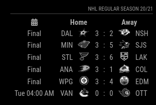
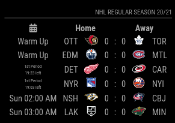
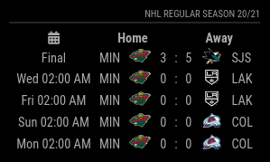

# MMM-NHL [](https://raw.githubusercontent.com/fewieden/MMM-NHL/master/LICENSE)  [](https://codeclimate.com/github/fewieden/MMM-NHL) [](https://snyk.io/test/github/fewieden/mmm-nhl)

National Hockey League Module for MagicMirror<sup>2</sup>

## Examples

  

## Dependencies

* An installation of [MagicMirror<sup>2</sup>](https://github.com/MichMich/MagicMirror)
* npm
* [node-fetch](https://www.npmjs.com/package/node-fetch)

## Installation

* Clone this repo into `~/MagicMirror/modules` directory.
* Configure your `~/MagicMirror/config/config.js`:

```js
{
    module: 'MMM-NHL',
    position: 'top_right',
    config: {
        // Add your config options here, which have a different value than default.
    }
}
```

* Run command `npm i --production` in `~/MagicMirror/modules/MMM-NHL` directory.

## Config Options

| **Option** | **Default** | **Description** |
| --- | --- | --- |
| `colored` | `false` | Remove black/white filter of logos. |
| `focus_on` | `false` | Display only matches with teams of this array e.g. `['VAN', 'MTL', 'BOS']`. |
| `matches` | `6` | Max number of matches displaying simultaneously. |
| `rotateInterval` | `20000` (20 secs) | How often should be rotated the matches in the list. |
| `reloadInterval` | `1800000` (30 mins) | How often should the data be fetched. |
| `daysInPast` | `1` | How many days should a game be displayed after it is finished. |
| `daysAhead` | `7` | How many days should a game be displayed before it starts. |
| `liveReloadInterval` | `60000 (1 min)` | How often should the data be fetched during a live game. |
| `showNames` | `true` | Should team names be displayed? |
| `showLogos` | `true` | Should team logos be displayed? |
| `showPlayoffSeries` | `true` | Should playoff series information (if in playoffs)? |
| `rollOver` | `false` | Displays today's games and based on game status also yesterdays games or tomorrows games. Automatically overrides `daysInPast` and `daysAhead` to 1. |

## Global config

| **Option** | **Default** | **Description** |
| --- | --- | --- |
| `locale` | `undefined` | By default it is using your system settings. You can specify the locale in the global MagicMirror config. Possible values are for e.g.: `'en-US'` or `'de-DE'`. |

To set a global config you have top set the value in your config.js file inside the MagicMirror project.


## Developer

* `npm run lint` - Lints JS and CSS files.
* `npm run docs` - Generates documentation.
